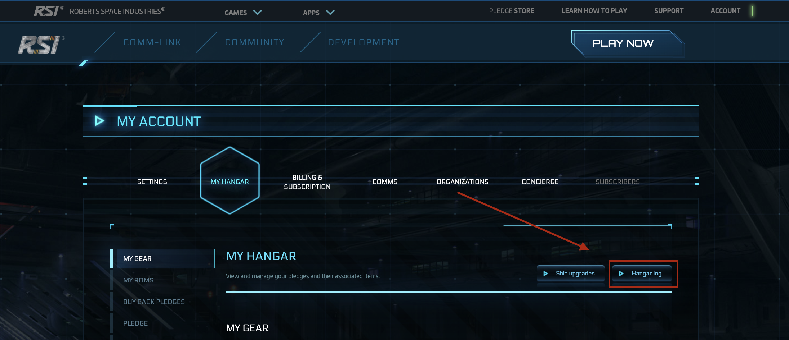
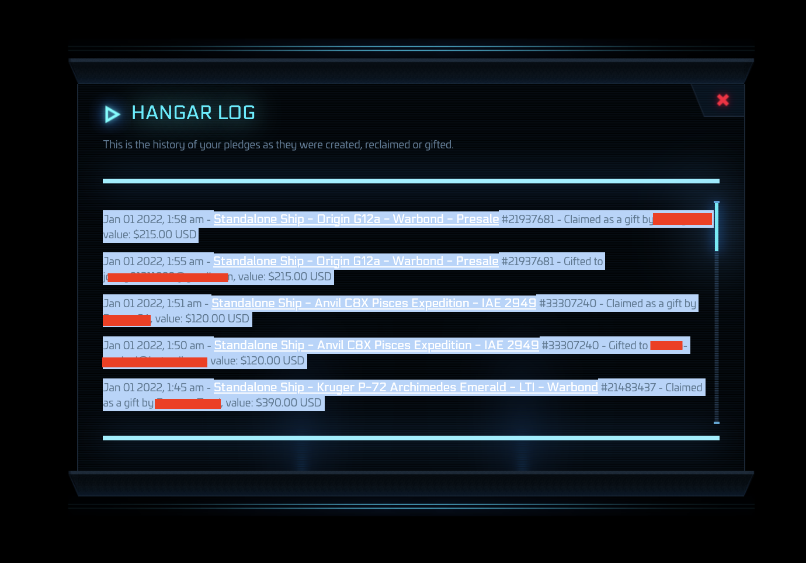

# gift_calendar.py

## Purpose
This tool was built for SC ship traders. CIG has this annoying policy where you can only send $1,000 worth of ships/items per day. From what I've gathered, this works on a sliding scale throughout the day. For example, if you gift a $500 ship at 5pm on day 1, then a $250 ship at 10pm on day 1, you will not be able to gift anything more than $250 until 5pm on day 2. 

This gets complicated when you're making lots of sales, so I built a program that ingests your hangar logs and the price of the ship you want to sell, builds a calendar, then tells you the next time that you will be able to sell a ship of that value.

## Prerequisites

1. Must have python3 installed and a basic understanding of how to execute python3 code
2. Must have access to the RSI account that is to be analyzed

## Usage

### Setup

1. Download `gift_calendar.py` from this repo. Save it somewhere on your machine.
2. Go to your RSI hangar and click on `Hangar log` (image below)

3. Copy all of the log events from the last 2 or 3 days just to be safe

4. Copy them into a text file in the same folder as `gift_calendar.py`. Name the file whatever you want. I did not upload a copy of my hangar logs to this repo for privacy reasons, although I did upload my calendar output. 
5. Run the program using the the usage instructions below.

### Executing the program

Usage instructions for the `gift_calendar.py` program are below:

```
$ python3 gift_calendar/gift_calendar.py -h
usage: gift_calendar.py [-h] -i INPUTFILENAME [-o OUTPUTFILENAME] -p
                        DESIREDSELLPRICE

Generates a calendar for your Star Citizen gifts and determines the next time
you can send a ship of a given value without hitting CIG's gift sending limit.

optional arguments:
  -h, --help            show this help message and exit
  -i INPUTFILENAME, --input-file INPUTFILENAME
                        Location of the file containing SC hangar logs.
  -o OUTPUTFILENAME, --output-file OUTPUTFILENAME
                        This program generates a calendar that is represented
                        by an array of floats. Each item in the array
                        represents 1 minute, starting from the earliest date
                        of a gift found in the hangar logs and ending 24 hours
                        after the latest date of a gift found in the hangar
                        logs. The value stored in each index of the array
                        represents the total dollars gifted in the 24 hours
                        prior to that minute. This can be helpful to show the
                        sliding scale of how your gifting restrictions drop
                        off. Not required to determine the date of your next
                        sale, only populate this flag if you want the raw
                        calendar data.
  -p DESIREDSELLPRICE, --price DESIREDSELLPRICE
                        The price of the ship you want to gift.
```

#### Example usage

If I made some sales recently and I wanted to know the next time I could sell a ship worth $355 USD, I would save my hangar logs to a file called `hangar_log_file.txt` and then run the following command:

```
$ python3 gift_calendar.py -i hangar_log_file.txt -p 355
```

CLI output:

```
The next time you will be able to gift a ship valued at $355.00 will be at 2022-01-02 01:43:00 UTC (make sure to convert to your timezone)
```

If I also wanted the output of the raw calendar placed into a file called `calendar_output.txt`, I would run it as follows:

```
$ python3 gift_calendar.py -i hangar_log_file.txt -o calendar_output.txt -p 355
```

This would generate the same CLI output as the command before, but it would also create a new file called `calendar_output.txt` which would be populated by a calendar of the gifts in last 24h per minute. Example file [here](calendar_output.txt).

## Notes

* I am in the US and have only tested this with USD currencies. I am not sure how it would behave with other currencies, but if you really want to try you can mess around with the `max_gift_value_per_day` variable (potentially convert it into your local currency)
* All results are in UTC format. I am pretty sure this is what the timestamps on the hangar logs are in (either UTC or GMT which are effectively the same).